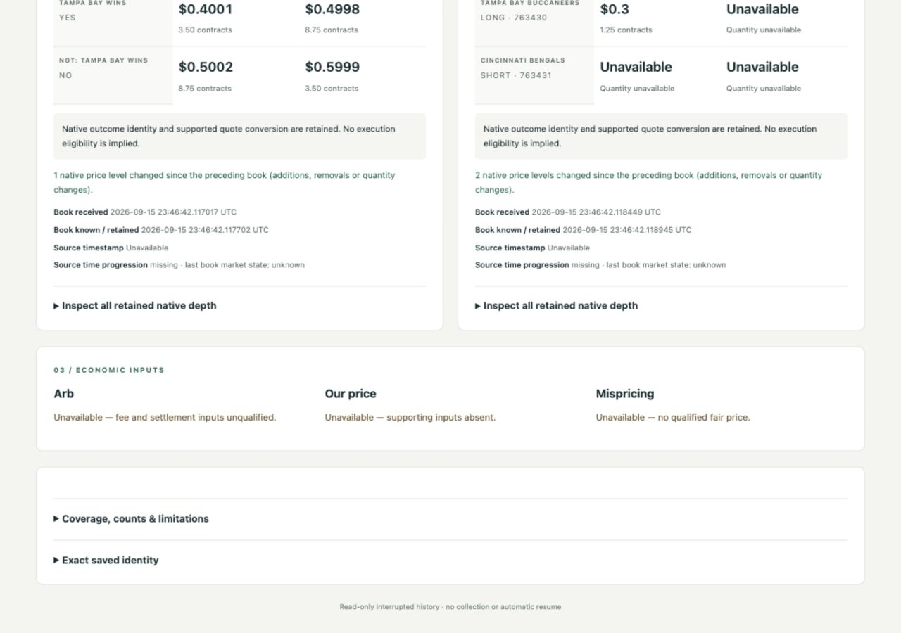
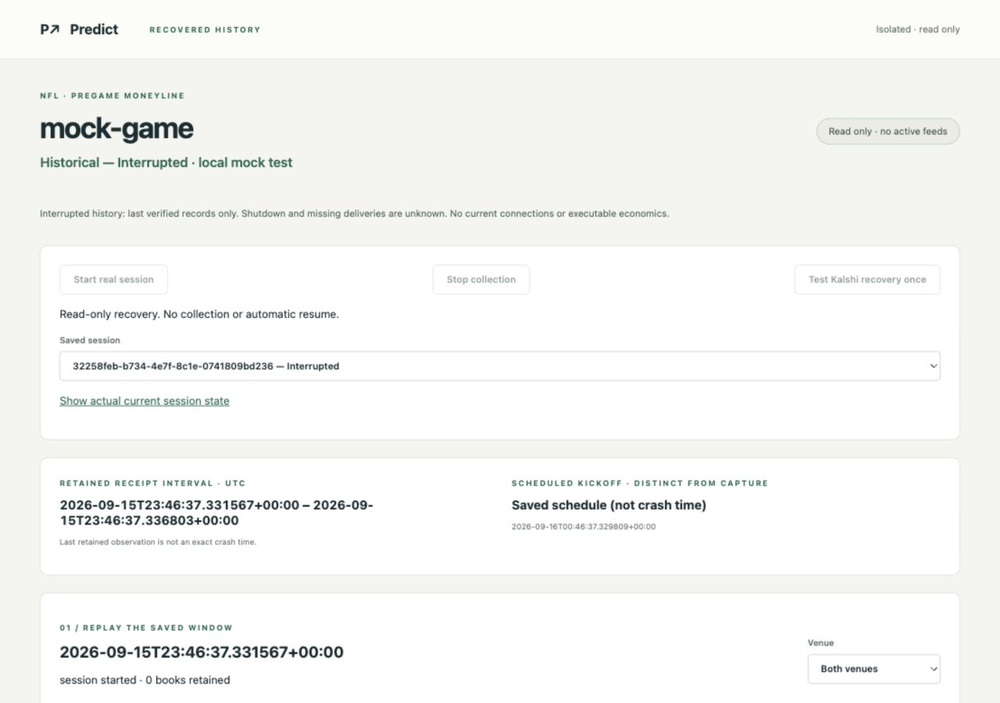
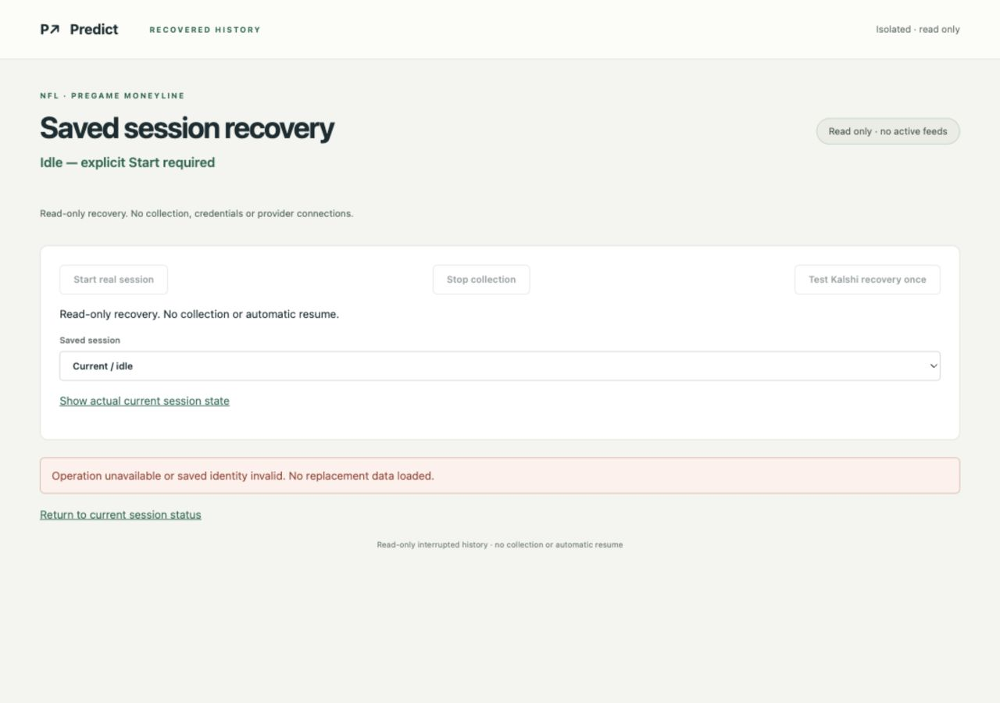

# E6 interrupted-session recovery

September 15, 2026. **Read-only reopening of a verified intact journal prefix is implemented and locally verified.** Five retained crash cases use localhost mock producers and actual parent-issued SIGKILL. No real collection, credentials or provider requests occurred. The consumed real-run guard is unchanged.

## Inspect the retained test history

The recovery preview was stopped after browser verification. Start a **separate read-only application** from any directory:

```sh
/Users/michaelfuscoletti/Desktop/prediction-arb/scripts/e6-recovery-preview start --port 8780
/Users/michaelfuscoletti/Desktop/prediction-arb/scripts/e6-recovery-preview status
/Users/michaelfuscoletti/Desktop/prediction-arb/scripts/e6-recovery-preview stop
```

Open **http://127.0.0.1:8780/** and choose session **`a5bed671-fa55-4f48-9a91-4b6db4031a86 — Interrupted`** for the intact-prefix example. The other four entries cover missing first images, reconnect, torn final write and incomplete finalization. The launcher prints the actual port if 8780 is occupied. Start/Stop here control only the identity-checked recovery preview process; there are no collection-capable controls in this reader.

This does not restart or alter the existing application on 8779 or the accepted views. New versioned recovery assets keep the running application's served assets unchanged. Browser verification used only the separate preview; its tab was closed and its process stopped afterward.

To create a separate recovery index for another **stable, inactive journal** without modifying it:

```sh
cd /Users/michaelfuscoletti/Desktop/prediction-arb
.venv/bin/python -m app.collection.recovery /absolute/path/session.jsonl --index /absolute/path/new-catalog/SESSION_ID/recovery.json
```

The index destination must be new. Existing completed manifests are routed to completed-session validation, never to a recovery fallback. For a custom catalog, use `.venv/bin/python -m app.dashboard.e6_recovery --catalog /absolute/path/new-catalog --port 8780`; stop that foreground reader with Ctrl-C. It starts idle and prohibits provider connections, credential-file reads and database connections.

## Exact candidate and changed files

HEAD remains **`0ab12b1e7b57f4ea89b6886c3d69b2459afaa258`**, with prior uncommitted work preserved. [Candidate manifest](../evidence/e6/interrupted-recovery/candidate.json): implementation SHA256 **`1a6e97809291fbf5530557f67bed41ed61ed1e41893a2069cbf547b8081e8df8`**, calculated over compact sorted JSON of the per-file SHA256 mapping.

- Added `app/collection/recovery.py`: stable read, strict record/dependency validation, prefix accounting, separate indexing and exact source-bound reopening.
- Updated `app/collection/transport_session.py`: journal writers hold a lifetime advisory lock, released on close or process exit.
- Updated `app/collection/native_replay.py`: exposes the existing native replay over already validated in-memory rows; file replay behavior remains unchanged.
- Updated `app/dashboard/e6_live.py`: reuses its exact-book verification over validated rows, lists indexed interrupted sessions, and accepts versioned recovery assets/loaders in new application instances.
- Added `app/dashboard/e6_recovery.py`, `app/dashboard/e6_recovery_static/{index.html,watch.js}` and `scripts/e6-recovery-preview`: read-only saved-session integration using the existing routes, cards, depth, styles and selection component.
- Added `tests/e6_recovery_crash_worker.py` and `tests/test_e6_recovery.py`.
- Added this report and `evidence/e6/interrupted-recovery/`; updated the Desktop tracker separately.

## Recovery rules

1. **Stable source only.** Read the source without writes, taking shared nonblocking locks on the journal and any existing E6 environment owner lock. Active E6 writers/owners are refused, even when quiet. Enforce 32 MiB and 4,096-record limits. Compare device, inode, size, modification/change times and SHA256 before/after parsing and native replay. The new writer lock complements the existing environment lock used by the live app.
2. **No skipping.** Verify every newline-terminated JSON record in order. Reject duplicate JSON keys, invalid envelopes, broken links, duplicate ingress IDs, conflicting session/source identities, out-of-order receipt times, missing/invalid initial specification, conflicting health context and unsupported record types. Any invalid complete record fails closed, including the final complete record. Only the unterminated final fragment may be excluded; it is not asserted to prove the cause of interruption.
3. **Dependencies are mandatory.** Selected metadata must match the existing native parser and a retained complete HTTP response. Discovery IDs/schedule/mapping must match the saved specification. Commands and frames must belong to valid current connection/subscription generations. Native frame bytes and hashes are checked. Books need selected metadata, current frames and native replay support. Derived unsynchronized/stale states require a recorded invalidation or valid freshness basis. Missing dependencies fail closed; no synthetic replacement image is introduced.
4. **No source repair.** Never truncate, append completion, rewrite or rename the source journal. Write a separate, exclusive-create recovery index. Its identity binds the complete source fingerprint, embedded specification digest, last verified byte offset/hash, excluded trailing-byte count, retained counts and native replay result. Reopening recomputes all of these and rejects unexpected changes, including changes confined to the excluded tail.
5. **Truthful status.** Without a terminal record, the result is **Historical — Interrupted**. If a terminal record exists but final export/manifest commitment is absent, show **interrupted finalization**, preserving what that terminal record actually states. No missing snapshot, clean shutdown, exact crash time or lost/pending delivery count is invented. The last retained timestamp is not the crash time. Historical connected states never establish current connectivity.
6. **No activation.** Recovery does not instantiate producers, load credentials, change the allowance, or resume collection. The isolated reader denies collection actions and runs with outbound/credential-file/database guards. Existing completed-session loading remains the normal path and fails closed rather than falling back to recovery when a completed manifest is invalid.

This is structural and native-dependency validation, **not cryptographic proof against every possible form of tampering**. A hash chain does not authenticate an origin or establish that all upstream events were recorded. Advisory locks coordinate E6 writers; they are not a security boundary against arbitrary noncooperating software. The index pins the local source identity observed during indexing, not an external authority's account of its history.

## Actual crash evidence and replay

Every retained case started the existing transport owner against two newly bound localhost HTTP/WebSocket mock producers. The parent waited for a recorded checkpoint, verified inspection was refused while the owner was alive, sent SIGKILL, waited for **exit code -9**, then indexed/replayed the stable file. Mock frames, deliberately injected sequence/reconnect behavior and adapted fixture metadata remain clearly labeled local tests; they are separate from real evidence.

| Case / session | Verified bytes | Excluded bytes | Frames | Book states | Packets | Prefix ingress |
|---|---:|---:|---:|---:|---:|---:|
| Intact / `a5bed671-fa55-4f48-9a91-4b6db4031a86` | 69,085 | 0 | 9 | 8 | 16 | 42 |
| Before first image / `32258feb-b734-4e7f-8c1e-0741809bd236` | 17,284 | 0 | 0 | 0 | 0 | 4 |
| During reconnect / `5c52619a-3455-4c74-974d-a7ed0780433a` | 74,151 | 0 | 9 | 9 | 18 | 45 |
| During finalization / `eee030dc-1932-4559-a18e-0a8ed9440095` | 71,838 | 0 | 9 | 8 | 16 | 46 |
| Torn final write / `affd42c4-204e-430e-840e-d55ce992130c` | 69,093 | 23 | 9 | 8 | 16 | 42 |

For each nonempty book case, **four synchronized Kalshi images and two synchronized Polymarket US images replay exactly**. Ordinary cases additionally retain two exact health-derived book states; the reconnect interruption retains three. All associated quote packets match. The fixture's deliberate sequence rejection remains in replay diagnostics. The before-image case exposes no book rather than borrowing a later image.

The finalization case was killed after the journal's terminal row, before any saved export/manifest commitment. Its terminal delivered/persisted counts are supported; its full saved-session finalization is not claimed complete. Other cases retain null total-delivered/persisted, lost, pending and crash-time values. Prefix ingress counts are durable verified rows, not assertions about total deliveries or losses.

Evidence: [crash summary](../evidence/e6/interrupted-recovery/crash-results.json), [original crash journals and process records](../evidence/e6/interrupted-recovery/crashes/), [separate indexes](../evidence/e6/interrupted-recovery/catalog/), [fresh-process replay with exact prefix hashes and source fingerprints](../evidence/e6/interrupted-recovery/independent-replay.json).

## Focused verification

**11 final focused tests passed**, plus the existing completed live-view UI-state regression and recovery-script syntax check. Coverage includes all five crash checkpoints; active-owner refusal; torn final bytes; malformed interior and complete final records; broken chains; conflicting identities; removed metadata/command/frame dependencies; source changes after indexing; exact prefix native replay; guarded offline reopening; read-only HTTP action rejection; and unchanged completed real-session replay/allowance behavior. Corruption tests used copies. Completed real sessions still replay 44/88 and 36/72 book-state/packet totals under their original evidence.

See [final tests](../evidence/e6/interrupted-recovery/final-tests.txt), [completed UI regression](../evidence/e6/interrupted-recovery/completed-ui-regression.txt), and [browser checks](../evidence/e6/interrupted-recovery/browser-checks.json). No broad performance matrix, owner acceptance checklist or 250 ms gate was repeated.

Actual browser verification checked interrupted/mock labeling, available books, missing first-image explanation, excluded-byte coverage, previous/cutoff and venue selection, exact reopening after reload, and rejection of a changed recovery identity without fallback. Temporary viewport settings were reset.






## Preservation, cleanup and remaining boundary

[Preservation audit](../evidence/e6/interrupted-recovery/preservation.json): **1,686 preexisting files checked**; only the three intended implementation files above changed. Original evidence/journals, accepted view assets and the live-run guard remained byte-identical. Every indexed crash source also remained unchanged after replay. No owner service, database, original journal or existing running application was restarted or modified. No credentials, provider requests, real capture, trading, commit, push or publishing.

All crash workers exited and were reaped; test fixtures used disposable directories. The standalone recovery browser tab and preview process were closed/stopped after evidence retention. [Cleanup record](../evidence/e6/interrupted-recovery/cleanup.json). The reproducible launcher above reopens only the separate reader.

**One concrete next action:** implement explicit disk-full/write-failure stop accounting with local fault injection, so partially accepted or unsaved work is reported precisely before entering this recovery path. No new live run is required for that scope. Continuous reliability, economic qualification and full E6 completion remain open. Stop after this recovery slice.
