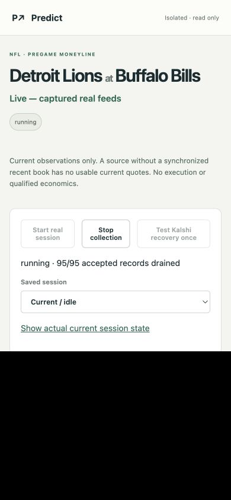
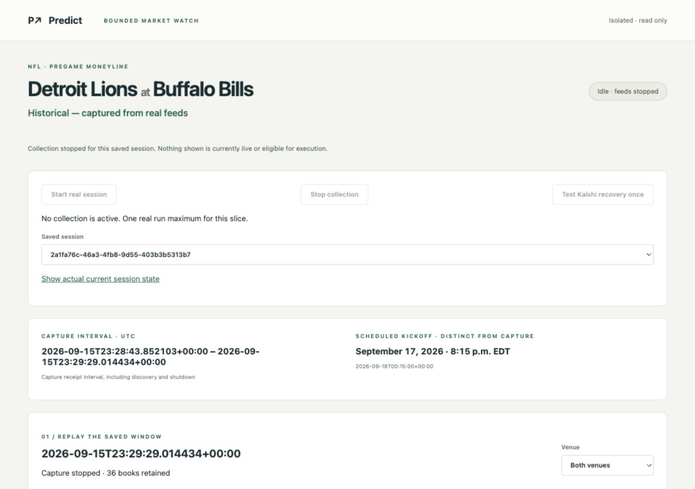
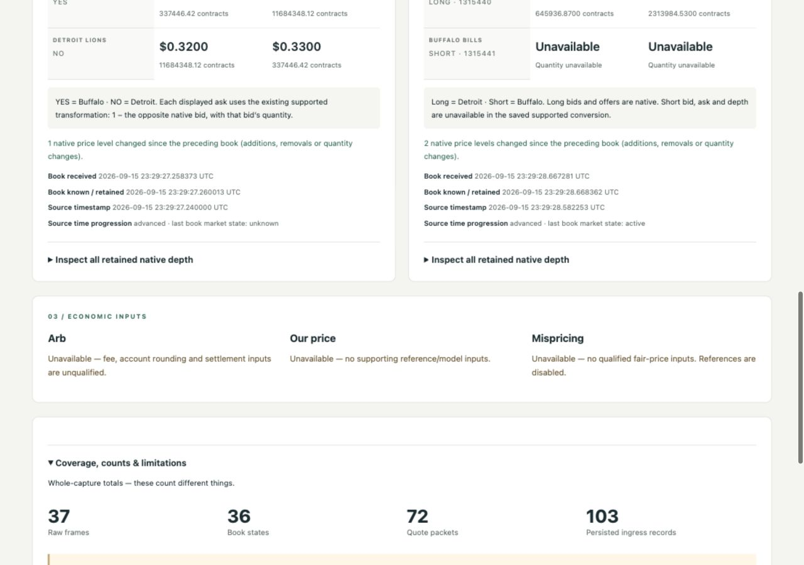

# E6 bounded live prediction-market watch loop

September 15, 2026. **Start → real updating books → controlled recovery → manual Stop → exact saved reopening is delivered for one supervised run.** The application is left open and idle, showing that saved session. Continuous reliability, economic qualification and full E6 completion remain open.

## Application and operation

**http://127.0.0.1:8779/** — isolated loopback app, file journals only. Existing services and accepted previews at other ports were not restarted or changed.

From any directory:

```sh
/Users/michaelfuscoletti/Desktop/prediction-arb/scripts/e6-live-watch start --port 8779
/Users/michaelfuscoletti/Desktop/prediction-arb/scripts/e6-live-watch status
/Users/michaelfuscoletti/Desktop/prediction-arb/scripts/e6-live-watch stop
```

These commands start/inspect/stop only the verified isolated application process. Starting the application does **not** start collection. The browser's **Start real session** creates the bounded session; **Stop collection** requests producer shutdown and shows stopping while accepted persistence/finalization remains. The authorized run has now been consumed: Start is disabled by a durable one-attempt guard, including across process restart. No additional run is authorized or started. Do not remove that guard to collect again under this scope.

Saved-session selection, venue selection, timeline and exact reopening are in the same app. URL state binds session, journal chain, cutoff and venue. Browser closure does not own collection. Server restart remains idle and never resumes a journal.

## Exact candidate

- Unchanged HEAD: `0ab12b1e7b57f4ea89b6886c3d69b2459afaa258`; existing uncommitted work retained.
- [Final implementation manifest](../evidence/e6/live-watch/candidate.json): SHA256 `e1f547dc1e4438272821fbe483a005424a27bb95518d348894863c11128c4e8c` over compact sorted JSON of the per-file SHA256 map.
- [Candidate used during capture](../evidence/e6/live-watch/capture-candidate.json): `225d50347098092c1b14ee25099244c60589904e916be09c1464bca99bb4dbe8`.
- After the one real run, local-only corrections made Stop/interruption feedback immediate, retained venue selection on the live-to-saved transition, and required all saved manifest files. These were checked with offline UI-state tests, focused local transport tests, fresh real-journal replay and browser reopening. **No second real run occurred.**

Changed/added implementation:

| File | Role |
|---|---|
| `app/collection/prediction_producer.py` | Explicit recorded client socket interruption, reusing native reconnect; quiet synchronized feeds remain connected while receipt freshness is assessed separately. Unsynchronized closed Kalshi streams retain disconnected health. |
| `app/dashboard/e6_live.py` | Idle server-owned lifecycle, one-attempt guard, bounded current projections, finalization, identity-bound saved reopening and derived-health replay verification. |
| `app/dashboard/e6_live_static/index.html`, `watch.js` | Integrated lifecycle controls and accepted book/timeline presentation. |
| `scripts/e6-live-watch` | Isolated launcher and verified process identity for stop/status. |
| `tests/test_e6_live_watch.py`, `test_e6_live_state.cjs` | Focused lifecycle, recovery, health, isolation, tampering and UI-state checks. |

Reused `TransportSession`, `ObservationJournal`, native adapters/reconstructors, authenticated credential mechanism and quote conversion. Reused the accepted view's card rendering, depth presentation, styles, selection and projection components without modifying its files. No replacement collector, database, economic engine or sportsbook dependency was introduced.

## Event, access and bounds

**Detroit Lions at Buffalo Bills**, NFL pregame moneyline, kickoff **2026-09-18 00:15 UTC / September 17, 8:15 p.m. EDT**. The prior candidate was still suitable. Current bounded discovery revalidated its schedule, participant mapping and active pregame market before subscription; no event switch occurred.

| Venue | Native event / market | Outcome mapping |
|---|---|---|
| Kalshi | `KXNFLGAME-26SEP17DETBUF` / `KXNFLGAME-26SEP17DETBUF-BUF` | YES Buffalo; NO Detroit |
| Polymarket US | `101466` / `657964`; slug `aec-nfl-det-buf-2026-09-17` | Long `1315440` Detroit; Short `1315441` Buffalo |

Existing dedicated project Keychain credentials were resolved only on explicit Start, using the already supported read-only production endpoints. The same-day [access evidence](e6-prediction-only-report.md#access) supplies the existing no-additional-cost access/rate basis. Authenticated connections succeeded. No account mutation, signup, paid product, upgrade, credential value export or sportsbook request occurred. Venue request limits were not treated as sportsbook credits. Native transport redaction checks remained active.

[Saved run configuration](../evidence/e6/live-watch/sessions/2a1fa76c-46a3-4fb8-9d55-403b3b5313b7/run-spec.json):

- **180-second collection deadline**, including initial discovery; manual Stop occurred well before it and before kickoff. Maximum authorized duration was 300 seconds.
- One selected market/source; at most two connection attempts/source and one concurrent socket/source; one controlled interruption on Kalshi only.
- At most 64 REST requests/source, throttled to at most one sequential request/second/source; 45-second periodic discovery cadence.
- At most 1,000 stream messages, 1 MiB frame/HTTP-body cap, 16 MiB source byte budget, single queued wire frame.
- Existing accepted queue 48 records / 4 MiB; ingress 2,048 records / 16 MiB; journal 4,096 rows / 32 MiB.
- One non-overlapping browser status poll/second, bounded timeout and server request capacity of eight. Polls read the local journal; they do not trigger provider discovery.
- Receipt freshness threshold 30 seconds. Quiet-feed aging does not infer disconnect or source latency.
- References disabled; additional spending **$0**. Arb, our price and Mispricing remain unavailable.

## One real verification session

Session: **`2a1fa76c-46a3-4fb8-9d55-403b3b5313b7`**.

Journal interval **2026-09-15 23:28:43.852103–23:29:29.014434 UTC**, **45.162331 seconds** including discovery and joined shutdown. Manual stop reason retained as `manual_stop`.

| Recorded quantity | Kalshi | Polymarket US | Total |
|---|---:|---:|---:|
| Raw WS frames | 21 | 16 | 37 |
| Synchronized native book images | 19 | 16 | 35 |
| Derived invalidation book states | 1 | 0 | 1 |
| Retained book states | 20 | 16 | 36 |
| Quote packets | 40 | 32 | 72 |
| Connection attempts | 2 | 1 | 3 |
| REST discovery requests | 3 | 7 | 10 |
| Conservative charged body bytes | 1,404,616 | 411,027 | 1,815,643 |

**103/103 accepted ingress records persisted**, plus a separate terminal completion row. These counts describe different things; a health-derived book is not another raw frame or a newly observed image. Conservative charged bytes include pending-frame reservations and are not asserted to equal delivered payload bytes.

### Controlled recovery

| UTC timestamp | Evidence |
|---|---|
| 23:28:51.875017 | Initial Kalshi synchronized image accepted; source connected |
| 23:29:02.540781 | Explicit `controlled_interruption` record: supervised client-induced close |
| 23:29:02.541336 | Kalshi disconnected; current projection hides its book immediately |
| 23:29:03.715968 | Replacement connection awaiting snapshot |
| 23:29:03.761308 | Connected only after a new synchronized native snapshot |
| 23:29:28.868928 | Kalshi disconnected during manual shutdown |
| 23:29:28.869759 | Polymarket US disconnected during manual shutdown |

Recovery took **1.220527 seconds** from the controlled marker to synchronized eligibility. Exact prefix projection at invalidation confirms Kalshi quotes unavailable while the retained healthy Polymarket US book remained inspectable. Native engine recovery owned the new subscription/generation; no old image was promoted into the new connection. Polymarket US stayed connected through the controlled Kalshi recovery interval.

The browser observed updating quantities, recorded recovery transitions and the same active session after its tab was closed and reopened. The initial immediate post-click browser snapshot preceded the asynchronous status refresh; it is not offered as a screenshot of invalidation. Server/journal ordering and exact-prefix checks establish the immediate invalidation. The final UI now hides the interrupted card and displays stopping feedback synchronously, verified offline without another real run.

This is **client-induced recovery**, not naturally occurring outage reliability. No native sequence rejection was recorded; the controlled connection gap remains explicit and does not establish gap-free upstream history.

### Stop, coverage and replay

Both native streams report closed, with terminal disconnected states, before completion is displayed. Accepted persistence work drained completely; finalization retained configuration, raw arrivals, derived books, health transitions, commands, diagnostics, complete export and replay evidence.

This short run completed one validated metadata discovery per source. All ten dispatched HTTP bodies were complete; no refresh was in flight at Stop and the periodic refresh interval was not reached after initial discovery. This does not erase the prior capture's incomplete final Polymarket US metadata refresh: that original evidence and accepted view are preserved unchanged.

Fresh-process native replay exactly matches **35 synchronized images and their 70 packets**. The additional invalidation state exactly preserves its preceding native image with the allowed synchronization change, and its two packets are checked exactly. Thus all **36 retained book states / 72 packets** are accounted for. Full saved export, configuration, file hashes and terminal journal chain are revalidated on reopening.

Journal chain SHA256: **`3d533e2df07e42cc9bd8e354e44bad346d59a9236544ee2afba14604ab588abf`**.

Evidence: [measured verification](../evidence/e6/live-watch/real-verification.json), [fresh independent replay](../evidence/e6/live-watch/independent-replay.json), [session files and manifest](../evidence/e6/live-watch/sessions/2a1fa76c-46a3-4fb8-9d55-403b3b5313b7/).

## Focused engineering and browser checks

Before capture: local controlled reconnect/resynchronization, manual Stop, deadline behavior, both native recovery mechanisms, stale-book hiding without false disconnect, healthy-other-source inspection, idle startup with credential/network lookups forbidden, exact saved replay/tamper rejection and persisted one-attempt restart guard passed. Local HTTP clients can close/reopen without owning the server. A first assertion exposed an ineligible/disconnected labeling overwrite; it was corrected before capture, with the initial result retained.

After local UI corrections: five focused Python checks passed; offline JavaScript checks passed for immediate Stop feedback, immediate controlled-invalidation quote hiding and venue retention on saved transition. Script syntax passed. See [pre-run focused checks](../evidence/e6/live-watch/focused-tests.txt), [HTTP checks](../evidence/e6/live-watch/http-tests.txt), [final checks](../evidence/e6/live-watch/final-tests.txt), [UI-state checks](../evidence/e6/live-watch/ui-state-tests.txt). Prior view/engine evidence was reused; no performance matrix or 250 ms gate was rerun.

Actual browser checked Start, live updates, controlled-recovery records, tab close/reopen during collection, manual Stop, saved selection, cutoff/venue navigation and reload. Narrow **390×844** viewport had no horizontal overflow; desktop **1280×900** was checked. The temporary viewport override was reset. No console errors were observed. After the run, only the new app was stopped/restarted; it reopened the same saved cutoff/venue and stayed idle, without reconnecting feeds. App tab is left operable.





## Preservation, limits and next engineering action

[Preservation check](../evidence/e6/live-watch/preservation.json): of **1,654** preexisting files, only the intended `prediction_producer.py` extension changed. Existing uncommitted work, prior saved journals/exports, accepted view code/evidence, E5 preview and archived sources remain intact. Owner database/services were not accessed or changed. No trading, account mutation, paid data, unattended collection, commit, push or publishing.

The accepted saved-real presentation remains owner-accepted with no changes requested. This integrated loop has engineering/browser verification; no new owner acceptance is inferred. The run does not qualify fees, account rounding, settlement equivalence, fair prices, profitability, natural-outage reliability, arbitrary event selection or continuous operation. Pending/incomplete journals are retained after a crash but are currently reported as incomplete rather than exposed as a replayable saved session.

**One concrete next engineering action:** add read-only reopening of an abruptly interrupted journal's intact prefix, using crash-injected local tests and explicit incomplete accounting. Preserve the original bytes and reject altered chains; do not auto-resume or require a new live run. This would address a concrete remaining durability gap without claiming continuous reliability or economic qualification. Stop after the present slice.
