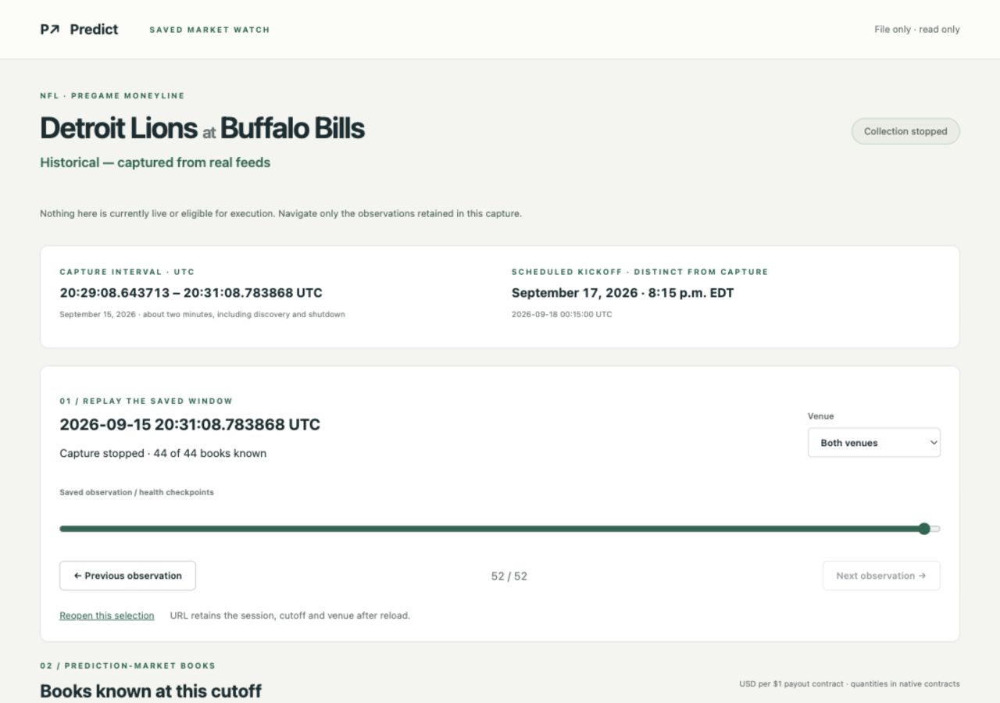
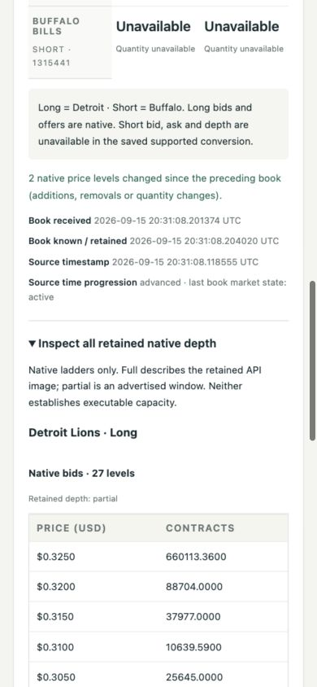
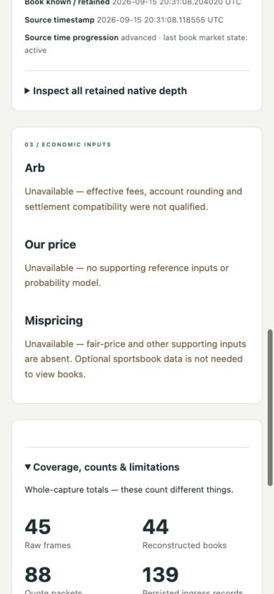
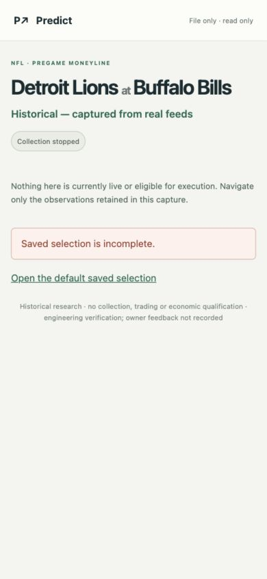

# E6 isolated saved-real-session market watch

Completed September 15, 2026. Engineering verification is complete for this file-only view; owner feedback has not been recorded. Continuous reliability, economic qualification and full E6 completion remain open.

## Open and operate

URL: **http://127.0.0.1:8778/**. The isolated view is running and its browser tab is left open. Use Previous/Next or the timeline, select a venue, expand native depth or coverage, and use **Reopen this selection** to retain the exact session, journal hash, checkpoint and venue. Reload validates the saved evidence again. Initial selection is the capture's terminal checkpoint.

From any directory:

```sh
/Users/michaelfuscoletti/Desktop/prediction-arb/scripts/e6-real-view start --port 8778
/Users/michaelfuscoletti/Desktop/prediction-arb/scripts/e6-real-view status
/Users/michaelfuscoletti/Desktop/prediction-arb/scripts/e6-real-view stop
```

Start prints the actual URL; if the requested port is occupied it chooses the next free loopback port. Status/Stop verify the saved process command and birth time. The launcher uses `.local/e6-real-view/`, independently of E5 and owner services. Stop/restart was exercised successfully; the view is left running at 8778.

## Exact candidate and saved identity

- HEAD unchanged: `0ab12b1e7b57f4ea89b6886c3d69b2459afaa258`, plus preserved uncommitted work.
- This slice's implementation SHA256: `fd27a1a2fda7f85d28e55da5ac92a107387be77bb1655ac088aa7d6c044f386f`. [Candidate manifest](../evidence/e6/saved-real-view/candidate.json) lists exact per-file hashes and digest method.
- Session: `75ec21c1-5962-48e1-96e2-5f6b5ef07150`.
- Event: **Detroit Lions at Buffalo Bills**, NFL pregame moneyline.
- Journal chain: `4a954b03a0e1146104a4ae6c319b3201e721a45eff356ec35fe506dbfb36c29a`.
- Capture journal interval: **2026-09-15 20:29:08.643713–20:31:08.783868 UTC**. The capture summary's process timer begins at `20:29:08.643372 UTC`; elapsed time is `120.1416390419472` seconds. The view labels journal boundaries, not a new capture.
- Scheduled kickoff: **2026-09-18 00:15 UTC / September 17, 8:15 p.m. EDT**, kept distinct from capture time.
- Source: [saved capture](../evidence/e6/prediction-only/real-20260915-discovery6/), [coverage audit](../evidence/e6/prediction-only/coverage-audit.json), [existing independent replay](../evidence/e6/prediction-only/independent-replay.json).

## Implementation and behavior

Added files:

- `app/dashboard/e6_real.py`: fixed-session loader, native replay validation, cutoff projections and read-only loopback server.
- `app/dashboard/e6_real_identity.json`: SHA256 pins for journal, configuration, summary, saved export, coverage and independent replay evidence.
- `app/dashboard/e6_real_static/{index.html,state.js,watch.js,watch.css}`: historical market watch and exact URL state.
- `scripts/e6-real-view`: isolated process launcher.
- `tests/test_e6_real_view.py`, `tests/test_e6_real_state.cjs`: focused loader, mapping, cutoff, isolation and interface-state checks.
- This report and `evidence/e6/saved-real-view/`; the Desktop tracker was updated separately.

Reused existing journal reopen, native venue replay and quote packet conversions; E5's selection component, shared dashboard styles and process isolation guard. No engine or native adapter was changed.

Every load verifies pinned file bytes, journal hash chain and terminal accounting, embedded versus saved specification, native IDs and metadata side meanings, saved export equality and independent native reconstruction. Files are rehashed after replay. Missing/altered evidence returns HTTP 422 and no observations. Invalid, incomplete, empty, duplicate or mismatched bookmark fields fail explicitly; no nearby cutoff or synthetic data is substituted.

The timeline contains **52** book/health/start/finish checkpoints. At each checkpoint the cards contain only the latest previously retained book and recorded health, with exact receipt age. Previous/Next traverses that shared timeline; the selected venue remains stable. Missing books are explicit. Changes count added/removed/changed-quantity native price levels against the immediately preceding book from that venue. There is no price interpolation. Whole-capture coverage totals are labeled separately from the number of books known at the selected cutoff.

| Venue | Native meaning | Display conversion |
|---|---|---|
| Kalshi `KXNFLGAME-26SEP17DETBUF-BUF` | YES Buffalo; NO Detroit | Existing bid quotes and supported ask = 1 minus opposite bid, carrying the opposite bid quantity. Native depth remains the original bid ladders; unavailable native offers remain unavailable. |
| Polymarket US event `101466`, market `657964`, slug `aec-nfl-det-buf-2026-09-17` | Long `1315440` Detroit; Short `1315441` Buffalo | Native long bid/offer and quantities. Short prices, quantities and ladders remain unavailable in the saved supported conversion. Side identity comes from metadata IDs and long flags, never array order. |

Prices and quantities remain decimal strings from verified native packets; monetary presentation never passes through JavaScript floating-point arithmetic. Source timestamps, local receipt and retained/known timestamps are distinct. Recorded connection and last-book synchronization are shown independently: a historically synchronized final book does not erase a later disconnected state or make collection live.

## Focused verification

- **6 Python tests passed**: every checkpoint versus prior journal observations, all displayed packets/depth, native mapping independent of array order, exact complementary prices/quantities, missing/altered evidence, read-only/error HTTP behavior and isolated startup.
- JavaScript state checks passed across all **52** cutoff identities, stable venue navigation, exact bookmark/reload and invalid identity/empty/duplicate rejection. Browser script syntax check passed.
- Native reconstruction matches **16 Kalshi + 28 Polymarket US = 44 books**, with **88 exact quote packets**, the same chain and no recorded sequence gaps as the existing independent replay.
- Separate totals preserved: **45 raw frames**, **44 reconstructed books**, **88 quote packets**, **139 persisted ingress records**. Terminal completion is a separate journal row; delivered and persisted both remain 139.
- Startup/loader passed in a subprocess with outbound connections, DNS, credential-file reads, child-process execution and database connections prohibited. Loopback server bind/start/cleanup succeeded. Deliberate blocked probes demonstrated guard enforcement without reading credential values or establishing connections. The normal launcher supplies a minimal credential-free environment; no provider, credential or database access was required or performed.
- Actual browser: desktop **1280×900** and narrow **390×844**; both venues and retained depth inspected; previous/next, first cutoff with no book, coverage, reload, bookmarked reopening and invalid-link error verified. Narrow document width equals viewport width (390); no horizontal overflow. No browser console errors were observed. Temporary viewport override was reset.
- Verified only the new process's stop/restart and exact final bookmarked reopening afterward.
- **1,626 preexisting app/test/document/script/evidence/example files remain byte-identical** to the entry manifest. Saved exports, E5 files and accepted preview, archived sources, owner database/services were not changed or accessed. No commit, push, publishing, provider request or new collection.

Evidence: [test output](../evidence/e6/saved-real-view/unittest.txt), [state checks](../evidence/e6/saved-real-view/state-tests.txt), [replay/preservation/browser record](../evidence/e6/saved-real-view/verification.json), [process identity](../evidence/e6/saved-real-view/process.json). The initial test invocation assumed pytest, which is not installed; tests were adapted to the repository's existing unittest runner, with no dependency installation.

### Screenshots

Final viewport captures are the review evidence. Earlier full-page captures are retained but have browser stitching artifacts and are superseded by these viewport images.







## Preserved limitations and next action

The deadline interrupted the final Polymarket US metadata refresh between requests: two validated US refreshes, third incomplete. Dispatched HTTP bodies were complete. No observed sequence gap does not establish complete upstream history, real reconnect reliability or continuous service reliability.

Arb economic qualification is unavailable because effective fee/account-rounding and settlement inputs were not qualified. Our price and Mispricing lack their supporting inputs. Optional sportsbook data is not required to inspect the saved books; none was requested. No probabilities, fees, purchasable short ask or profitable result was manufactured.

**One concrete next action:** the owner opens this saved-real market watch and records whether the native outcome labels, timeline and unavailable states are understandable. This is new-view feedback, separate from accepted E5 and from engineering verification. Stop at this completed view slice; any collection, continuous-reliability or economic-qualification work requires a new scope.
